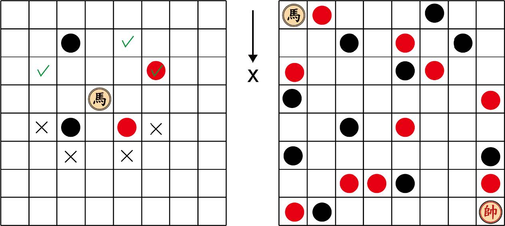
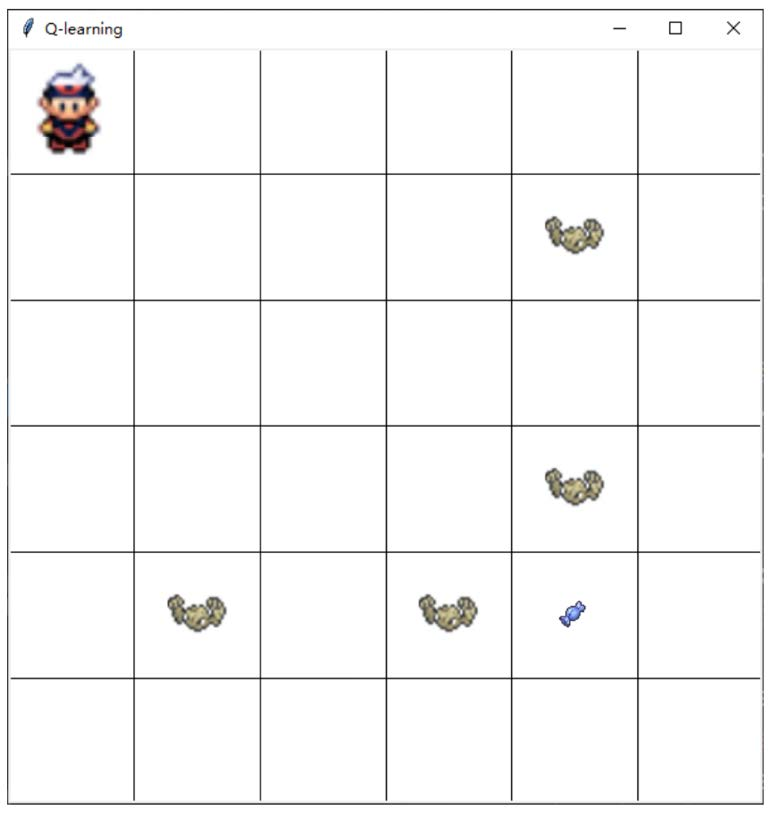
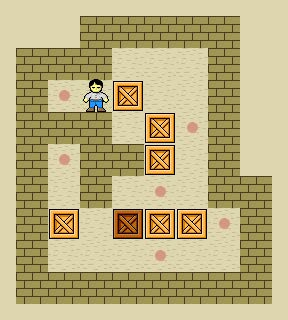

# HW_AIPrinciple
TCY 2024春季学期 自动化系 人工智能原理课程作业与项目代码

## HWCode1：搜索算法的应用

### 问题描述
在中国象棋中，“马”的走法为跨越“日”字形的对角线，俗称“马走日”。除此之外，棋盘上的其余棋子也可能会干扰“马”的行动。一方面已有己方棋子的地方不能下棋；另一方面，在“马”跨越对角线的同侧长边相邻位置如果有己方或敌方的棋子则也不能行动。现在有一个大小为 n*n 的方形棋盘，马的初始位置为 S（0，0），敌方帅的位置为E（n-1，n-1），另外棋盘上有 30%的位置被障碍棋子（敌我双方各 15%）随机占据。假定除了“马”外，其余棋子保持不动，请问需要多少步移动，“马”才能吃到对方的帅？



当n=8、100、1000时，开发搜索方法求解最小移动次数的路径。

### 解答

本次作业中，我们实现了BFS、GBFS和A*算法对该问题进行求解。

本次作业我采用C++实现，要运行代码，请确保环境中的`make`与`g++`工具可以使用。

使用命令：

```bash
make && ./build/main
```

即可编译并运行程序。


1. 代码运行会按给定代码的形式构建一个随机棋盘（种子由时间初始化，因此每次不同），并打印出来供参考；

2. 随后程序会进行搜索，搜索结束时输出找到的路径（或找不到）及象棋整体的轨迹图与最终棋盘（即有吃子后的）；
3. 在运行搜索的过程中，程序会计时并在搜索结束后输出。

- 程序默认黑色`B`为己方，红色`R`为。


## HWCode2：神经网络的应用

### 问题描述

MNIST 是经典的手写数字数据集，包含了 0 到 9 共 10 种手写数字的图像，每张图像大小均为 28*28。利用对字体的膨胀与腐蚀操作，我们可以得到变“粗”（如下左图）和变“细”后的手写数字，此即为本次作业采用的 Morpho-MNIST 数据集。图像存储在npy 文件里，已划分为训练集和测试集；图像对应的标签存储在 csv 文件里，标签注释有 2 种，一种是 0 到 9 共 10 种数字类型标签，一种是粗或细共 2 种字体粗细标签。

**题目1**：使用训练集的图像及其对应的粗或细 2 种字体粗细标签，训练一个 Logistic 回归模型，完成图像字体粗细的二分类，计算模型在测试集上的 Accuracy， Precision， Recall， F1-score， auROC 等指标，并画出 ROC 曲线

**题目2**：使用训练集的图像及其对应的 0 到 9 共 10 种数字类型标签，训练一个 Softmax 回归模型，完成图像数字类型的十分类，计算模型在测试集上的 Accuracy，macro-Precision，macro-Recall，acro-F1-score，auROC等指标，并展示混淆矩阵

### 解答

本次作业`morpho_mnist.py`中包含主函数，直接运行该文件即可：

```bash
python morpho_mnist.py
```

程序会输出各种测试集上的指标，并绘制题目1的ROC曲线、题目2的混淆矩阵。

需要安装的dependencies为：

```markdown
pandas
numpy
scikit-learn
matplotlib
tqdm
seaborn
```


## HWCode3：强化学习的应用

### 问题描述
一个 6 × 6 的方形迷宫中有一只神奇糖果和一些挡路的石头，人物的起始位置(Start)和糖果的位置(Goal)固定，如图所示。人物在迷宫中探索，最终目的为找到糖果。规定只可以进行上下左右四个方向的移动，迷宫中的石头为障碍无法通过 （石头的数量和分布可以直接沿用下面图片的设置，也可以自己随机生成） 。



**题目**：试对问题进行建模，给出本问题的状态空间、行动集合、状态转移概率及回报。自定折现因子的取值，任选一种强化学习方法，编程解决上述问题。

### 解答

**状态空间**：小人在地图中可能的位置集合

**行动集合**：上、下、左、右移动一格（共四种行动），在边角位置无效的行动可以使用但状态不会改变。

**状态转移概率**：在Q-Table中定义每个状态对应执行四个行动的Q值，并定义一个递减的用于探索的变量$\varepsilon \in [0, 1]$，以$\varepsilon$的概率随机选择动作，以$1-\varepsilon$的概率选择最大Q值的动作，即：

​	对于Q值最大的Action对应的下一个State（相等时取上、下、左、右中靠前的一个），转移概率为$1-\frac{3}{4}\varepsilon$;

​	对于其他的三个Action对应的下一个State，转移概率为$\frac{1}{4}\varepsilon$.

**回报**：由于原环境的回报过于稀疏，需要极长的时间训练，因此我们应用启发式的方法对每一步未结束的动作根据人与糖果间的距离基于奖励/惩罚。

​	当前位置为糖果时回报为1000（并结束游戏）；

​	当前位置为石头时回报为-1000（并结束游戏）；

​	当前位置为空地时回报为当前位置与糖果距离平方的相反数（按一格为1计算，理论的取值范围为`[-50, 0]`）。


本次作业在`main.py`中定义了Q- Learning方法与主函数，直接运行该文件：

```bash
python main.py
```

程序会先训练一个Q表，同时按训练过程均匀取`record_rounds`个点打印学得的Q表（此时程序窗口的更新无需参考）。

此外，程序也会记录这些次尝试的动作轨迹，在训练结束后，窗口会从`Episode 0`开始播放动作轨迹的演化过程，直到训练的最后。


需要安装的dependencies为：

```markdown
pandas
numpy
```

我们选择折现因子`discount_factor = 0.9`，`epsilon = 0.1`并按每个episode以`0.97`的比例衰减，以`learning_rate = 0.1`更新Q表，并训练100个episode。


## TermProject1：基于搜索算法的推箱子游戏

### 问题描述

如下图所示，将箱子推到洞口位置，人物可以向上下左右四个方向运动，但无法通过障碍物，且只能推箱子不能拉箱子，请你设计搜索算法，找出合适的方法把它们全部推到洞口。



(1)实现初始场景的生成。主要包括生成多种地图，即初始位置， 箱子和洞口的数
量和分布情况。
(2)若箱子被推到洞口后不会消失（可以再次被推出来） ，且箱子和洞口不存在一
一对应的关系，设计一种搜索算法，找到最优的移动路线（人物移动的次数最少） 。
(3)若箱子被推到洞口后会消失，且箱子和洞口一一对应，设计一种搜索算法，找
到最优的移动路线。

### 代码环境要求与运行方法介绍

本项目使用Python完成，图形界面使用`tkinter`实现，没有使用第三方依赖库。

要运行程序，需要保证当前系统具有**不低于Python 3.8**的环境，使用

```bash
python3 ./main.py
```

来运行题目1、2、3的效果展示。

> 另外，如需测试命令行下的键盘控制游戏，可以在命令行运行：
>
> ```bash
> python3 ./SokobanMap.py
> ```
>
> 这一测试程序使用了`curses`模块，因此可能需要在类Unix环境下运行。


运行main程序，会按顺序执行`main1()`、`main2()`、`main3()`，分别代表前3问的结果，关闭窗口即可转到下一问的程序。

#### 第一问：多种地图生成

程序中第一句表达式即规定了生成规则：

```python
# Create a SokobanMap with 20x20 size, 6 boxes, 8 goals, and 40 obstacles
sokoban_map = SokobanMap(20, 20, 6, 8, 40)
```

其中阻挡墙、箱子和目标会依次随机放置在整张图上，且程序会自动在边界加入阻挡墙。

修改传入的参数即可实现任意长宽（不小于3x3）与内部物体数量（数量合理的前提下）的地图初始化。

其中目标数和障碍数缺省时会由程序按规则自动决定。

#### 第二问：不消失、不对应的最优路线

在本题中，我使用A*算法实现路径的搜索，根据移动次数代价与每个箱子与目标的最近xy距离和作为启发函数进行搜索。

搜索完成后，程序会展示小人推箱子的动画，代表搜索得到的路径。

由于生成的地图时常没有解，较难搜索，为方便演示我在这段程序中指定了随机数种子，将：

```python
sokoban_map.set_seed(66)  # tested solvable situation
```

注释掉即可实现其他随机地图的生成与无解重试，直到找到有解的地图会进行展示。


#### 第三问：消失、对应的最优路线

为兼容本问要求，程序加入了两个模式切换的选项，可以选择：

```python
sokoban_map.mode = "eat"  # default to "stay"
sokoban_map.mode = "1to1"  # default to "1toN"
```

来实现箱子的消失和洞口的一对一实现，程序在其任意组合的其他两种情况也可以运行。

基于以上假设，箱子在到达指定洞口时会与洞口一同消失，若到达了其他洞口则会展示为在洞口上（但不消失也不算成功）。

我们依然使用A*算法实现路径的搜索，不过将启发函数简化为对应箱子与洞口的曼哈顿距离。

本问中我们同样固定了随机种子，你可以将：

```python
sokoban_map.set_seed(13)  # tested solvable situation
```

注释掉即可实现其他随机地图的生成与无解重试，直到找到有解的地图会进行展示。


### 搜索算法简介

本题中使用了标准的A*算法，使用一个PriorityQueque存储下一次待访问的节点并使用一个set记录已经经过的状态。

每次取出节点会按小人可以走的四个方向来寻找子节点，并用代价+启发函数的方式决定优先级，直到找到一个已解决的地图为止。

由于我们总取最小的曼哈顿距离之和作为启发函数，其是一致可采纳的，因此保证了A*算法的最优性。


## TermProject2：基于神经网络的图像分类

图像分类是计算机视觉中基本任务，也是图像检测、图像分割、物体跟踪、行为分析等其他高层视觉 任务的基础。本题尝试进行风景图片的分类，涉及的场景图像数据集包括 6 类（建筑，森林，高山，冰川，街景，大海），共计 17034 张图像，图像大小 150×150。本次项目提供训练集 10901 张，验证集 2726 张， 测试集 3407 张，本数据质量较高，类别样本均衡。 类别信息分别存储在 train_data.csv, val_data.csv, test_data.csv 。

在本次实验中，我设计了简单的卷积神经网络进行训练，并分别从模型结构、训练超参数与数据集增强改进了模型的训练，并使用`torchcam`进行了一些梯度可视化。

本项目代码的详细介绍见[该代码文件夹下的readme文件](TermProject2/readme.md)